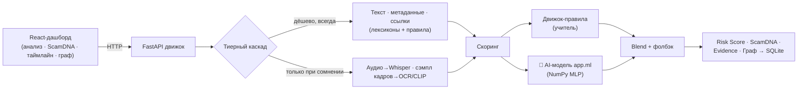
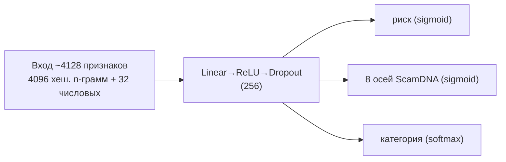

<div align="center">

# 🛡️ AI Media Watch · Sentinel Media AI

**Мультимодальный движок оценки риска мошенничества для коротких видео из соцсетей —
с собственной обучаемой AI-моделью, объяснимостью и устойчивостью к обходу фильтров.**


</div>

---

## 🎯 Проблема

Соцсети массово заливаются финансовым мошенничеством — нелегальные онлайн-казино,
финансовые пирамиды, «инвест-клубы», схемы «пиши + в директ». Цель мошенников —
люди в поиске заработка, особенно в **RU/KZ**-сегменте. Ручная модерация не
масштабируется и **не объясняет** свои решения, а простые фильтры по ключевым
словам легко обходятся обфускацией (`г@рантир0ванный д0ход`, `к а з и н о`).

## 💡 Решение

**AI Media Watch** — это не «бан-автомат», а **инструмент приоритизации**: он
ранжирует контент по риску, **объясняет каждый сигнал** и ловит даже намеренно
замаскированные схемы. Финальное решение остаётся за человеком.

> Формулировка результата: *«контент содержит признаки, требующие проверки»* — а не
> автоматическое обвинение.

## ✨ Ключевые особенности

| | |
|---|---|
| 🧠 **Собственная AI-модель** | Обучаемая нейросеть (не словарь, не чужой API), обученная **дистилляцией из экспертных правил** + синтетика |
| 🛡️ **Устойчивость к обходу** | Хеширование символьных n-грамм ловит обфускацию: recall **1.00 vs 0.49** у правил |
| 🔍 **Объяснимость** | Каждый вердикт раскладывается на **8 осей ScamDNA** + атрибуции признаков + таймлайн + граф связей |
| 🎚️ **Калибровка + неопределённость** | Честные вероятности (ECE 0.047) + флаг «спорно → на ручную проверку» (active learning) |
| ⚡ **Тиерный каскад** | Дешёвые текстовые сигналы решают большинство мгновенно; тяжёлый ML — только при сомнении |
| 🪶 **Lite / Full режимы** | Работает на чистом Python; ML-полосы (Whisper/OCR/CLIP) включаются при наличии зависимостей. Никогда не падает |

## 🏗️ Архитектура



## 🧠 AI-модель — что это за ИИ

Это **не LLM и не линейная регрессия**, а **собственный многозадачный
многослойный перцептрон (MLP)**, обученный с нуля на NumPy.



- **Обучение:** backpropagation + Adam, потери BCE + cross-entropy + L2.
- **Дистилляция (weak supervision):** движок-правила = «учитель», размечает данные;
  нейросеть-«ученик» учится **обобщать за пределы правил**. Плюс синтетика с
  известными метками и аугментациями (обфускация, перефраз).
- **Устойчивость к обходу:** `г@рантир0ванный` делит символьные 3-граммы с
  `гарантированный` → модель узнаёт, хотя точного слова в словаре нет.
- **Портативность:** обучается на CPU за <1 минуты, артефакт — маленький `.npz`,
  для инференса нужен только NumPy.

Подробности — в [`backend/app/ml/DESIGN.md`](backend/app/ml/DESIGN.md) и
[`backend/models_store/MODEL_CARD.md`](backend/models_store/MODEL_CARD.md).

## 📊 Результаты

На held-out выборке (1208 примеров: 583 скам / 625 безопасных / 733 обфусцированных):

| Метрика | 🧠 Модель | 📜 Правила (учитель) |
|---|---|---|
| AUROC | **0.9999** | 0.962 |
| F1 | **0.938** | 0.666 |
| Recall | **1.00** | 0.50 |
| ECE (калибровка) | **0.047** | 0.219 |
| Точность категории | **98.5 %** | — |
| Ошибка по 8 осям (MAE) | **0.017** | — |

**🎯 Главное — обфускация:** на замаскированных скамах модель даёт recall
**1.00 против 0.49** у правил (**+0.51**) — то, ради чего всё затевалось.

> ⚠️ Метрики получены на **синтетических данных** (cold-start без разметки через
> дистилляцию). На реальных данных будут скромнее — но превосходство над правилами
> на обфускации показательно. Валидация на реальных кейсах — в дорожной карте.

## 🛠️ Технологии

| Слой | Стек |
|---|---|
| Фронтенд | React 18, Vite, TypeScript, Tailwind, Framer Motion, Recharts |
| Бэкенд | Python 3.13, FastAPI, Pydantic v2, Uvicorn |
| Модель риска | NumPy (MLP с нуля), feature hashing (blake2b), temperature scaling |
| Извлечение (опц.) | Whisper / faster-whisper (ASR), Tesseract (OCR), CLIP / open-clip (визуал), ffmpeg |
| Хранение | SQLite |

## 🚀 Запуск

**Требования:** [Python 3.13+](https://python.org), [Node.js 18+](https://nodejs.org).

### 1. Бэкенд (движок)
```bash
cd backend
python -m venv .venv
.venv\Scripts\python.exe -m pip install -r requirements.txt   # Windows
# затем:
.venv\Scripts\python.exe -m uvicorn app.main:app --port 8000
```
→ API + интерактивный Swagger: **http://localhost:8000/docs**

### 2. Фронтенд (дашборд)
```bash
npm install
npm run dev
```
→ **http://localhost:5173**

### 3. (Опц.) Переобучить модель
```bash
cd backend
.venv\Scripts\python.exe -m app.ml.cli train       # генерирует данные + обучает на CPU
.venv\Scripts\python.exe -m app.ml.cli evaluate    # метрики + MODEL_CARD.md
.venv\Scripts\python.exe -m app.ml.cli predict --text "Г@рантир0ванный д0ход, казино"
```

## 🔌 API

| Метод | Эндпоинт | Описание |
|---|---|---|
| `GET` | `/api/health` | Статус движка + доступные ML-полосы |
| `POST` | `/api/analyze` | Анализ загруженного видео (multipart) |
| `POST` | `/api/analyze/url` | Анализ по метаданным/субтитрам (без скачивания) |
| `GET` | `/api/cases` | Проанализированные кейсы |

```bash
curl -X POST http://localhost:8000/api/analyze/url \
  -H "Content-Type: application/json" \
  -d '{"title":"Заработок на слотах","description":"Гарантированный доход, пиши в директ","hashtags":"#казино"}'
```

## ⚖️ Этика и ответственный ИИ

- **Риск-ориентированность:** высокий балл = повод проверить, не доказанное нарушение.
- **Человек в контуре:** спорные кейсы (флаг неуверенности) уходят на ручную проверку.
- **Приватность:** система не хранит персональные данные пользователей.
- **Без авто-приговоров:** никаких юридических заключений — только приоритизация.

## 🗺️ Дорожная карта

- [ ] Сбор и разметка **реальных** данных → дообучение и честная валидация
- [ ] Полный медиа-пайплайн в проде (ASR/OCR/CLIP на GPU-воркерах)
- [ ] Обучение трансформер-варианта ([`model_torch.py`](backend/app/ml/model_torch.py)) на масштабе
- [ ] Прод-инфраструктура: Docker + PostgreSQL + очередь задач + S3
- [ ] Loop активного обучения через дашборд аналитика

## ⚠️ Ограничения (честно)

- Метрики на синтетике — реальная производительность ещё не подтверждена.
- В MVP движок анализирует загруженный файл / метаданные, а не качает видео из соцсетей (ToS + скорость).
- Категоризация иногда неточна (общий риск верный, ярлык категории может ошибаться).

## 📁 Структура

```
.
├── src/                    # React-фронтенд (дашборд)
├── backend/
│   ├── app/
│   │   ├── pipeline/       # каскад + оркестратор
│   │   ├── analyzers/      # ASR / OCR / vision / текст / поведение / ссылки
│   │   ├── scoring/        # ScamDNA · Risk Score · категория · timeline · evidence
│   │   ├── ml/             # 🧠 собственная модель (featurize, model_np, train, ...)
│   │   ├── store/          # SQLite + база знаний + граф
│   │   └── api/            # FastAPI роуты + схемы
│   ├── models_store/       # обученный артефакт + MODEL_CARD.md
│   └── README.md           # подробная документация движка
└── README.md               # этот файл
```

---

<div align="center">

*Мы не баним за вас — мы за секунды показываем аналитику, **что** подозрительно и
**почему**, и ловим даже то, что специально маскируют под обход фильтров.*

</div>
