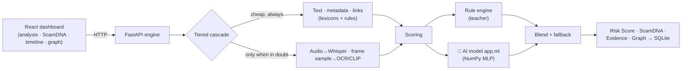
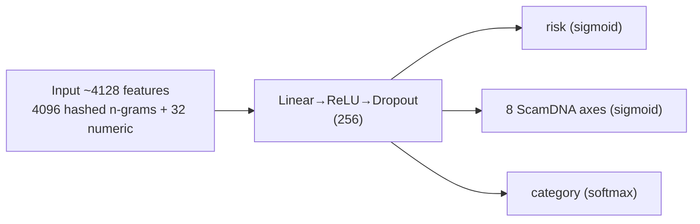

<div align="center">

# 🛡️ AI Media Watch · Sentinel Media AI

**A multimodal scam-risk engine for short-form social-media video —
with a custom trainable AI model, explainability, and resilience against filter evasion.**


</div>

**English** · [Русский](README.ru.md)

---

## 🎯 The Problem

Social platforms are flooded with financial fraud — illegal online casinos,
Ponzi schemes, "investment clubs," "DM me" pitches. Scammers target people
looking to make money, especially in the **RU/KZ** segment. Manual moderation
does not scale and **cannot explain** its decisions, while simple keyword
filters are trivially bypassed with obfuscation (`g@rante3d inc0me`, `c a s i n o`).

## 💡 The Solution

**AI Media Watch** is not a "ban bot" but a **prioritization tool**: it ranks
content by risk, **explains every signal**, and catches even deliberately
disguised schemes. The final decision stays with a human.

> How we phrase the result: *"the content shows indicators that warrant review"* —
> not an automatic accusation.

## ✨ Key Features

| | |
|---|---|
| 🧠 **Custom AI model** | A trainable neural network (not a dictionary, not a third-party API), trained via **distillation from expert rules** + synthetic data |
| 🛡️ **Evasion resilience** | Character n-gram hashing catches obfuscation: recall **1.00 vs 0.49** for rules |
| 🔍 **Explainability** | Every verdict decomposes into **8 ScamDNA axes** + feature attributions + timeline + relationship graph |
| 🎚️ **Calibration + uncertainty** | Honest probabilities (ECE 0.047) + a "disputed → send to manual review" flag (active learning) |
| ⚡ **Tiered cascade** | Cheap text signals resolve most cases instantly; heavy ML runs only when in doubt |
| 🪶 **Lite / Full modes** | Runs on pure Python; ML lanes (Whisper/OCR/CLIP) turn on when dependencies are present. Never crashes |

## 🏗️ Architecture



## 🧠 The AI Model — What Kind of AI This Is

This is **not an LLM and not linear regression**, but a **custom multi-task
multi-layer perceptron (MLP)**, trained from scratch on NumPy.



- **Training:** backpropagation + Adam, losses BCE + cross-entropy + L2.
- **Distillation (weak supervision):** the rule engine is the "teacher" that labels
  the data; the student network learns to **generalize beyond the rules**. Plus
  synthetic data with known labels and augmentations (obfuscation, paraphrase).
- **Evasion resilience:** `g@rante3d` shares character 3-grams with
  `guaranteed` → the model recognizes it even though the exact word is not in any dictionary.
- **Portability:** trains on CPU in <1 minute, the artifact is a tiny `.npz`,
  and inference needs only NumPy.

Details are in [`backend/app/ml/DESIGN.md`](backend/app/ml/DESIGN.md) and
[`backend/models_store/MODEL_CARD.md`](backend/models_store/MODEL_CARD.md).

## 📊 Results

On a held-out set (1208 examples: 583 scam / 625 safe / 733 obfuscated):

| Metric | 🧠 Model | 📜 Rules (teacher) |
|---|---|---|
| AUROC | **0.9999** | 0.962 |
| F1 | **0.938** | 0.666 |
| Recall | **1.00** | 0.50 |
| ECE (calibration) | **0.047** | 0.219 |
| Category accuracy | **98.5 %** | — |
| Error across 8 axes (MAE) | **0.017** | — |

**🎯 The key point — obfuscation:** on disguised scams the model delivers recall
**1.00 versus 0.49** for rules (**+0.51**) — exactly what this was built for.

> ⚠️ Metrics were obtained on **synthetic data** (a cold start with no labels, via
> distillation). On real data they will be more modest — but the edge over rules
> on obfuscation is telling. Validation on real cases is on the roadmap.

## 🛠️ Tech Stack

| Layer | Stack |
|---|---|
| Frontend | React 18, Vite, TypeScript, Tailwind, Framer Motion, Recharts |
| Backend | Python 3.13, FastAPI, Pydantic v2, Uvicorn |
| Risk model | NumPy (MLP from scratch), feature hashing (blake2b), temperature scaling |
| Extraction (opt.) | Whisper / faster-whisper (ASR), Tesseract (OCR), CLIP / open-clip (vision), ffmpeg |
| Storage | SQLite |

## 🚀 Getting Started

**Requirements:** [Python 3.13+](https://python.org), [Node.js 18+](https://nodejs.org).

### 1. Backend (engine)
```bash
cd backend
python -m venv .venv
.venv\Scripts\python.exe -m pip install -r requirements.txt   # Windows
# then:
.venv\Scripts\python.exe -m uvicorn app.main:app --port 8000
```
→ API + interactive Swagger: **http://localhost:8000/docs**

### 2. Frontend (dashboard)
```bash
npm install
npm run dev
```
→ **http://localhost:5173**

### 3. (Opt.) Retrain the model
```bash
cd backend
.venv\Scripts\python.exe -m app.ml.cli train       # generates data + trains on CPU
.venv\Scripts\python.exe -m app.ml.cli evaluate    # metrics + MODEL_CARD.md
.venv\Scripts\python.exe -m app.ml.cli predict --text "Г@рантир0ванный д0ход, казино"
```

## 🔌 API

| Method | Endpoint | Description |
|---|---|---|
| `GET` | `/api/health` | Engine status + available ML lanes |
| `POST` | `/api/analyze` | Analyze an uploaded video (multipart) |
| `POST` | `/api/analyze/url` | Analyze by metadata/captions (no download) |
| `GET` | `/api/cases` | Analyzed cases |

```bash
curl -X POST http://localhost:8000/api/analyze/url \
  -H "Content-Type: application/json" \
  -d '{"title":"Заработок на слотах","description":"Гарантированный доход, пиши в директ","hashtags":"#казино"}'
```

## ⚖️ Ethics and Responsible AI

- **Risk-oriented:** a high score is a reason to review, not a proven violation.
- **Human in the loop:** disputed cases (the uncertainty flag) are routed to manual review.
- **Privacy:** the system does not store users' personal data.
- **No auto-verdicts:** no legal conclusions — only prioritization.

## 🗺️ Roadmap

- [ ] Collect and label **real** data → fine-tuning and honest validation
- [ ] Full media pipeline in production (ASR/OCR/CLIP on GPU workers)
- [ ] Train a transformer variant ([`model_torch.py`](backend/app/ml/model_torch.py)) at scale
- [ ] Production infrastructure: Docker + PostgreSQL + task queue + S3
- [ ] Active-learning loop through the analyst dashboard

## ⚠️ Limitations (honestly)

- Metrics are on synthetic data — real-world performance is not yet confirmed.
- In the MVP the engine analyzes an uploaded file / metadata rather than downloading video from social platforms (ToS + speed).
- Categorization is sometimes imprecise (overall risk is correct, the category label may be wrong).

## 📁 Structure

```
.
├── src/                    # React frontend (dashboard)
├── backend/
│   ├── app/
│   │   ├── pipeline/       # cascade + orchestrator
│   │   ├── analyzers/      # ASR / OCR / vision / text / behavior / links
│   │   ├── scoring/        # ScamDNA · Risk Score · category · timeline · evidence
│   │   ├── ml/             # 🧠 custom model (featurize, model_np, train, ...)
│   │   ├── store/          # SQLite + knowledge base + graph
│   │   └── api/            # FastAPI routes + schemas
│   ├── models_store/       # trained artifact + MODEL_CARD.md
│   └── README.md           # detailed engine documentation
└── README.md               # this file
```

---

<div align="center">

*We don't ban on your behalf — in seconds we show analysts **what** is suspicious and
**why**, and we catch even what was deliberately disguised to slip past filters.*

</div>
